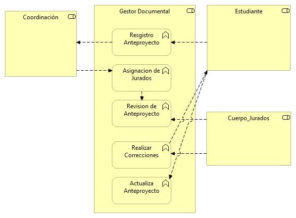

# Archimate-Gestor-Documental

# Nombres: 	
- **Andres Camilo Lozano Palacios       20201099038**
- **Cristian Manuel Gonzalez Mejia	    20201099032**
- **Julio Cesar Reina Panche		        20201099045**

Arquitectura software de gestión documental para el proceso de revision de tesis en la especializacion en ingenieria de software de la universidad distrital

### PUNTO DE VISTA ORGANIZACIONAL

### PUNTO DE VISTA DE LAS FUNCIONES DEL NEGOCIO

### PUNTO DE VISTA DE LOS PROCESOS
