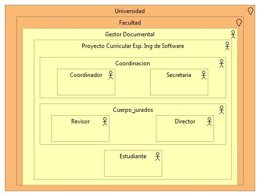

# Archimate-Gestor-Documental

# Nombres: 	
- **Andres Camilo Lozano Palacios       20201099038**
- **Cristian Manuel Gonzalez Mejia	    20201099032**
- **Julio Cesar Reina Panche		        20201099045**

Arquitectura software de gestión documental para el proceso de revision de tesis en la especializacion en ingenieria de software de la universidad distrital

### PUNTO DE VISTA ORGANIZACIONAL

### PUNTO DE VISTA DE LAS FUNCIONES DEL NEGOCIO

### PUNTO DE VISTA DE LOS PROCESOS

### PUNTO DE VISTA ESTRUCTURA DE APLICACIONES

### PUNTO DE VISTA USO DE APLICACIONES

### PUNTO DE VISTA DE USO DE INFRAESTRUCTURA

### PUNTO DE VISTA A NIVEL DE CAPAS

El punto de vista de capas en Archimate a diferencia de otro tipo de diagramas como UML, muestra un panorama general con capas dedicadas y capas de servicio, en donde cada capa dedicada expone una capa de servicio, permitiendo tener una vista interna y externa de la aplicación y de como deberá ser el proyeto, dando así una prespectiva global a todos los involucrados. 

En la Aplicación de las metodologías agiles como SCRUM este tipo de diagramas de estructura pasan por desapercibido generando problemas de escalabilidad, diseño y decision. A través de este punto de vista se puede tener un medida del impacto de los cambios y del rendimiento de la aplicación al agregar nuevos servicios.

### PUNTO DE VISTA DE MAPEO GENERAL
